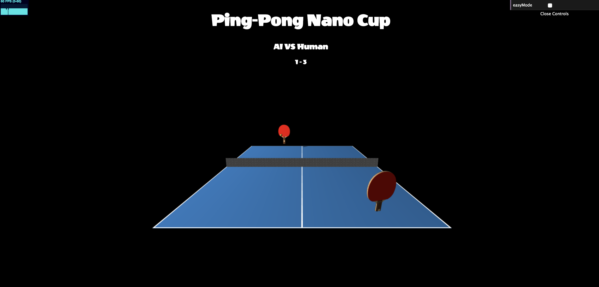

# Ping-Pong Nano Cup

## Overview
 - This is a 3D ping pong game, user uses Leap Motion to control the ping-pong paddle movement.

### Link to live game
 - Please click here to play the game, LEAP MOTION IS REQUIRED [GitHub page](https://liaa2.github.io/Ping-Pong-Nano-Cup/)
 - A short video [Demo](https://drive.google.com/file/d/1tpCQKAI8iyXd3TQ8omqKaJ2j8SfSigPE/view)

### Instructions
 1. AI takes the first serve when the game starts, after that the first serve person would be the player who lose in the previous round.
 2. AI serves the ball for each point.

### Features
 - User could move their hand faster when hit the ball, makes it bounces faster.
 - Paddle's left & right rotation is made via wrist rotates anticlockwise & clockwise. Paddle's up and down rotation is made via palm rotates up and down.
 - Ball would bounce back with different angle and speed based on incoming ball's position and velocity.
 - Mouse Pad mode is available for users who don't have Leap Motion (need to uncomment that part of codes in main.js).

### Libraries used
- Three.js
- Leap Motion

### Wishlist
 - Adjust the AI paddle rotation angle more accurately to increate the successful rate.
 - Use more strict condition to check if the ball has touched the net & human paddle, make it more realistic.
 - Spin.
 - Two human player mode, control each side via Leap Motion.
